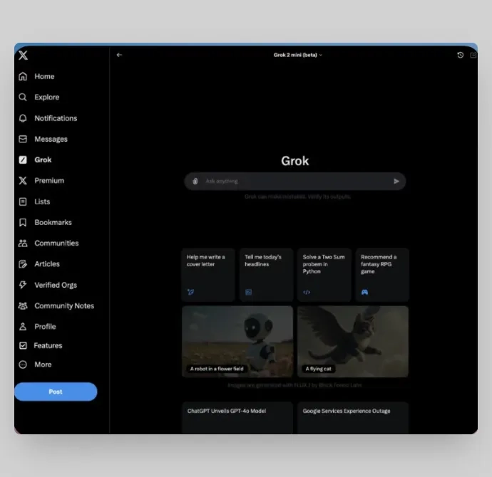
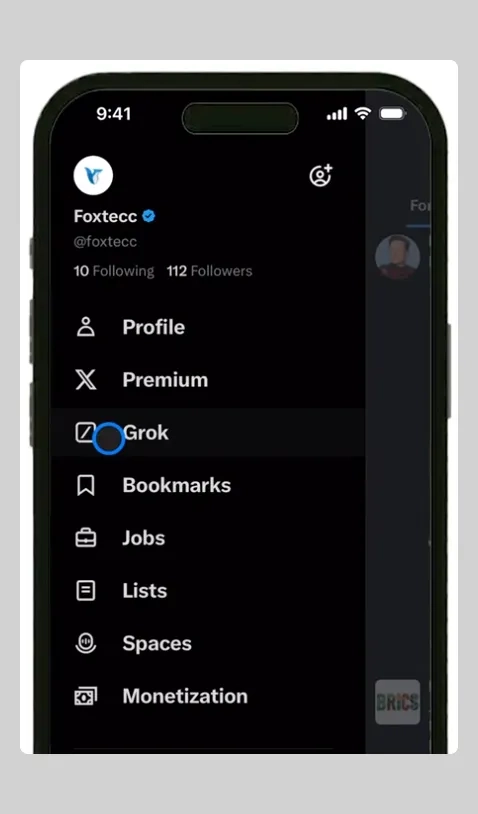
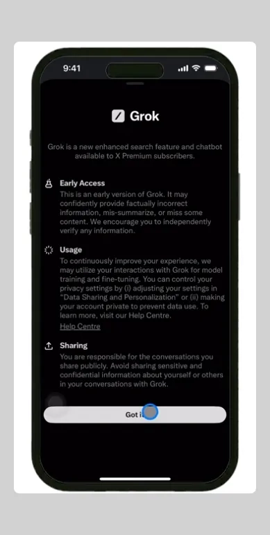

# Grok AI 完全使用指南：从新手到熟练的实操教程

---

自从 Claude 在 AI 圈掀起热潮后，Grok 成了另一个让人眼前一亮的存在。这款由埃隆·马斯克的 xAI 团队在 2023 年 11 月推出的 AI 聊天工具，很快就吸引了一大批用户。不少人觉得，Grok 未来可能会在 AI 领域占据重要位置。

现在 Grok 已经可以用了，但问题是：你真的知道怎么用吗？

别担心，这篇文章会手把手教你在不同设备上使用 Grok AI。从电脑到手机，从基础操作到高级功能，我们都会讲到。

---

## Grok AI 到底是什么？

简单说，Grok AI 是马斯克旗下 xAI 公司开发的高级聊天机器人。它的定位是帮企业实现任务自动化、获取数据洞察、改善决策流程。

你可以用 Grok 干什么？写博客、调试代码、起草邮件、生成图片、头脑风暴、分析数据……基本上你能想到的，它都能帮上忙。最关键的是，操作起来很流畅，没有那种机械感。

Grok 的风格比较特别——诙谐、直率，甚至有点叛逆。和其他 AI 聊天机器人不同，它不会回避敏感话题，该说的就直接说。这种"不装"的态度，反而让很多人喜欢。

技术层面，Grok 最初基于 Grok-1 语言模型，现在已经升级到 Grok-2，还有个轻量版叫 Grok-2 mini。不过有个门槛：目前只有 X（就是以前的 Twitter）的 Premium 或 Premium+ 会员才能用，每月 16 美元。

---

## 在电脑上使用 Grok AI：5 步搞定

### 第 1 步：订阅 X Premium+

首先得成为 X 的高级会员。访问 X 的订阅页面，点击"升级到 Premium+"，支付费用就行。如果你已经是会员，跳过这步。

### 第 2 步：授权并登录 Grok

订阅后，访问 Grok AI 的官方门户，用你的 X 账号登录。授权只需几秒钟，完成后你就能在 X 的左侧菜单栏里看到 Grok 入口了。

### 第 3 步：检查地区可用性

这里有个坏消息：Grok 还没有全球覆盖。如果你尝试访问时看到"您所在地区目前无法提供"的提示，说明你那里暂时用不了。

建议先 Google 搜索一下"Grok 在（你的地区）可用吗"，确认一下情况。

### 第 4 步：留下邮箱等通知

如果你所在地区暂时用不了，别灰心。Grok 正在扩大覆盖范围，很快就会支持更多地区。在等待页面留下你的邮箱，一旦开放就会通知你。

### 第 5 步：开始探索 Grok 界面

如果你能正常访问，会看到一个类似 ChatGPT 的界面。中间有个聊天框，写着"问任何问题"。输入你的问题，Grok 就会回复。

界面上还有个附件图标，点击可以上传文件。不管是数据分析还是报告生成，上传文件后 Grok 都能帮你处理。

---

## 在手机上使用 Grok AI

如果你更习惯用手机，下面这个流程适合你。

### 第 1 步：更新 X 应用

Grok 只在最新版的 X 应用里可用。打开 App Store（iPhone）或 Google Play（Android），搜索"X"，检查有没有更新。有的话赶紧更新。

### 第 2 步：打开 X 并进入设置

打开 X 应用，登录账号。点击左上角的头像打开侧边菜单，找到"设置"或"更多"选项。

### 第 3 步：激活 Grok AI

在设置里找到 Grok 或 AI 功能相关的选项。如果你是 Premium 会员且地区支持，就能看到激活按钮。按照提示开启就行。

### 第 4 步：开始使用

激活后，你就能直接和 Grok 聊天了。输入问题或请求，Grok 会基于 X 平台的实时数据给你回复。

如果你想深入了解 **Grok Super 会员的更多高级功能和使用技巧**，可以看看👉 [这篇详细评测，告诉你 Grok Super 会员一个月成品号值不值得入手](https://shaoyumi.com/buy/66)。

---

## Grok AI 能帮你做什么？

Grok 的功能其实挺丰富的，下面是几个主要用途。

### 1. 业务流程自动化

Grok 能帮你自动化很多重复性工作，省时省力。

- **客户服务**：用 Grok 做自动聊天机器人，处理常见客户问题，减轻客服团队压力。
- **邮件管理**：Grok 可以自动分类邮件，按重要性排序，甚至根据你公司的沟通风格起草回复。不过需要先训练一下。
- **内容生成**：不管是营销文案、产品描述还是报告，Grok 都能帮你快速生成。

### 2. 数据分析和机器学习

Grok 的机器学习能力让它在数据分析方面表现出色。

- **数据分析**：Grok 能快速处理大量数据，找出客户行为、市场趋势、运营绩效等关键信息。
- **预测模型**：基于历史数据，Grok 可以帮你预测未来结果，比如销售预测、库存管理、预算规划等。

### 3. 系统集成

Grok 可以和很多常用的商业工具集成，提升现有软件的效率。

- **CRM 集成**：和 Salesforce、HubSpot 等客户关系管理系统对接，自动跟踪客户互动。
- **ERP 集成**：支持 SAP、Oracle 等企业资源规划系统，优化资源管理。
- **会计软件**：可以和 QuickBooks、Xero 等会计平台集成，自动处理发票、费用跟踪、财务报告等。

### 4. 数据可视化

Grok 的可视化工具能把复杂数据变成容易理解的图表。

- **自定义仪表板**：创建个性化仪表板，显示销售额、客户满意度等关键指标。
- **交互式图表**：生成动态图表和图形，帮你更快洞察数据。

### 5. 个性化选项

Grok 的一个独特功能是可以调整"性格"，适应你的品牌风格。

- **自定义语气**：不管你想要正式、友好、诙谐还是随意的风格，Grok 都能配合。
- **多语言支持**：Grok 支持多种语言，在不同语言环境下都能保持品牌调性。
- **情境理解**：根据不同场景调整表达方式，客户咨询时专业，社交互动时轻松。

---

## Grok AI 的价格

Grok 目前只对 X 的付费会员开放，价格如下：

- **X Premium**：每月 8 美元或每年 84 美元。可以访问 Grok 和标准订阅的所有功能。
- **X Premium+**：每月 16 美元或每年 168 美元。除了 Grok，还能享受无广告浏览和优先体验新功能。

---

## 常见问题

**Grok AI 比 ChatGPT 更好吗？**

很难说哪个更好，两者各有优势。Grok 在实时响应和上下文理解上表现不错，ChatGPT 则更擅长创作和优化长篇内容。

**Grok AI 现在可以用了吗？**

是的，Grok 已经上线，但还没有覆盖全球所有地区。而且只有 X 的 Premium 和 Premium+ 会员才能用。

**有办法免费用 Grok AI 吗？**

目前 Grok 只对付费会员开放，没有免费版。要用的话必须先订阅 X Premium 或 Premium+。

---

## 写在最后

这篇文章详细介绍了如何在电脑和手机上使用 Grok AI。记住两个前提：你得在支持的地区，而且需要 Premium 或 Premium+ 订阅。

Grok 的功能挺全面的——数据分析、内容创作、个性化回复、业务自动化……能帮你简化很多日常工作，提升决策效率。如果你正在寻找一个能实际解决问题的 AI 工具，👉 [Grok Super 会员一个月成品号（质保 30 天）](https://shaoyumi.com/buy/66)可能是个不错的选择。希望这篇指南能帮你更好地利用 Grok！
